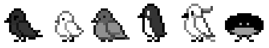
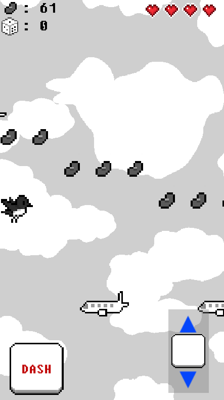
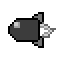
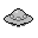
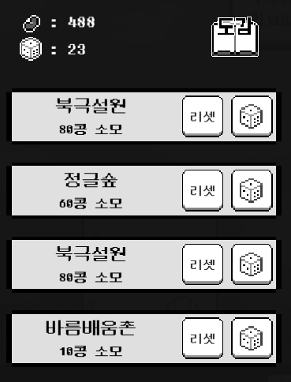
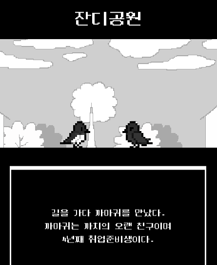

# 🕊️GodBird: 아무말 게임

### 🕊️새들의 낙원을 만들어보자!

#### 👑Developed By 무말랭이 팀👑

[문지현](https://github.com/solidcellaMoon) [이다영](https://github.com/dayoung100) [김시현](https://github.com/kimsihyun00) [최지원](https://github.com/jiwon199) [이서영](https://github.com/dltjdud808)

#### 목차

- [스토리](#Story)
- [콘텐츠 일람](#Contents)
  - [신의 축복](#신의-축복-재화를-모아보자)
  - [대화하기](#외출-다양한-새들과-만나자)
  - [수집하기](#수집-캐릭터와-건물)

## Story

### "빛이 있으리라...!"

> 1억마리의 새가 살고 있는 행성 B1607-2의 짹짹마을에 사는 평범한 조류시민 까치는 어느 날 꿈을 꿉니다. 
>
> 까치는 꿈 속에서 형태를 알 수 없는 자가 예언을 하고 자신의 몸을 감싸는 경험을 하게 됩니다.
>
> 이 꿈을 통해 전지전능한 그 분의 신의 계시를 받고 행성의 멸망과 구원, 
>
> 그리고 세상의 평화를 위해서 그 분을 믿어야만 한다고 생각합니다. 

### 새들에게 그 분의 말씀을 널리 알리기 위한 외출이 시작됩니다!

# Contents

## 신의 축복: 재화를 모아보자!

### 장애물을 피하거나 공격하며 재화를 얻어봅시다!

### 재화

|            종류             |                             설명                             |
| :-------------------------: | :----------------------------------------------------------: |
|      |   **콩**은 새들의 화폐단위로, 건물을 증축할 때 사용됩니다.   |
|  |     **주사위**는 외출 코스를 바꿀 때 사용할 수 있습니다.     |
|   | **하트**를 얻으면 더 오래 축복을 받을 수 있습니다! 최대 3번까지 등장합니다. |

### 장애물

|          종류          |                  설명                   |
| :--------------------: | :-------------------------------------: |
|   |   **비행기**는 일직선으로 다가옵니다.   |
|  | **로켓**은 까치를 발견하면 돌진합니다.  |
|   | **UFO**는 위아래로 움직이며 다가옵니다. |

## 외출: 다양한 새들과 만나자!

### 지역에 따라 출현하는 새가 달라집니다!

주사위를 굴려 원하는 지역을 뽑을 수 있습니다!

### 새들의 성격에 맞춰 대화해봅시다!

상황에 따라 적절히 대답하여 호감도를 올릴 수 있습니다!

## 수집: 캐릭터와 건물

### 게임을 진행할수록 까치의 보금자리가 북적입니다!

|            버튼             |                             설명                             |
| :-------------------------: | :----------------------------------------------------------: |
|     |      NPC들의 등장 지역과 호감도 상황을 알 수 있습니다.       |
|  | 달력에는 **오늘의 날짜**가 표시되며, 터치하면 **이번주 목표 금액**을 확인할 수 있습니다. |

